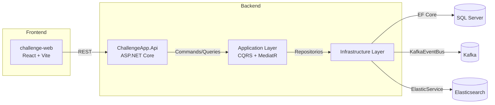
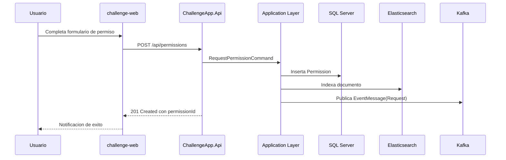
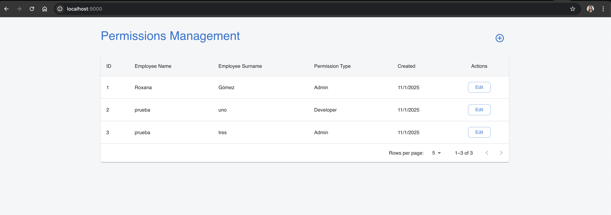
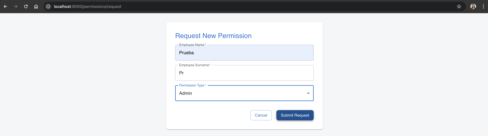
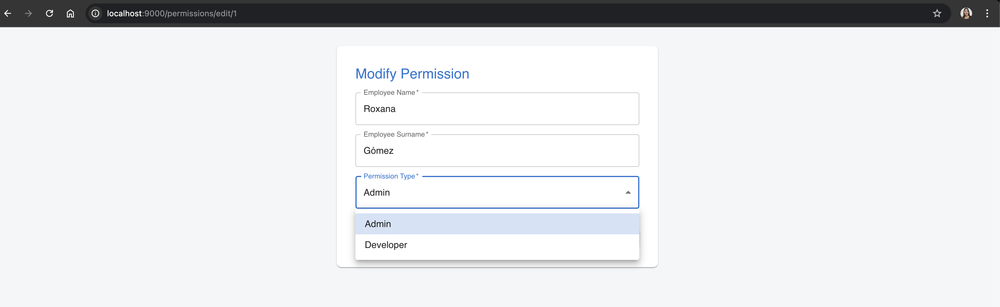
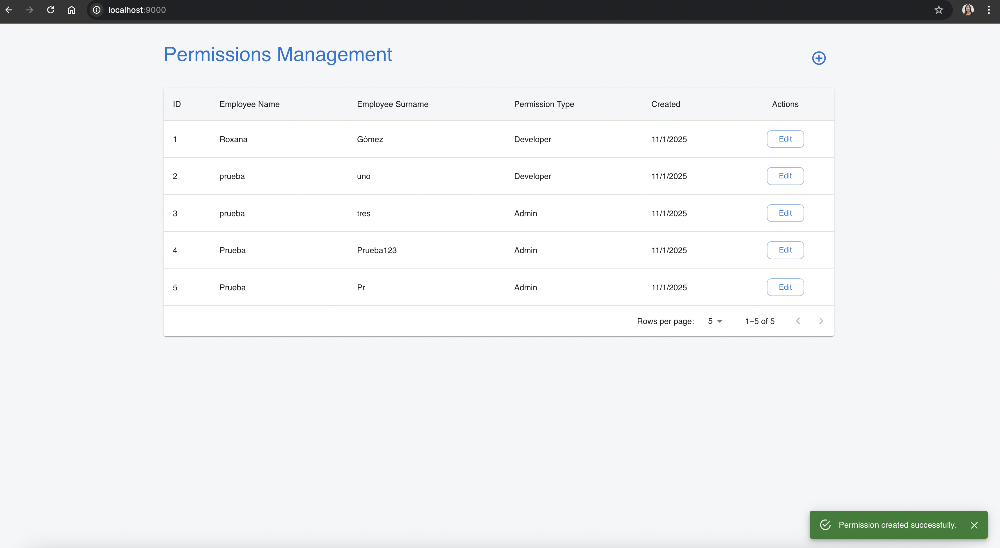
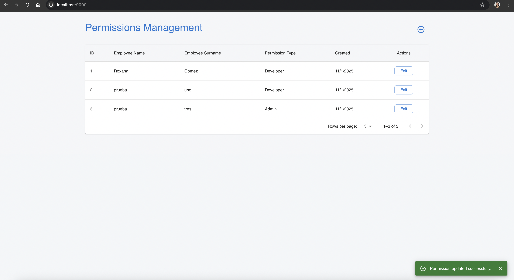

# Challenge-N5

Repositorio con dos aplicaciones ChallengeApp y challenge-web que se integran para realizar gestiones de permisos de empleados.
- `ChallengeApp`: API .NET 8 con capas de dominio, aplicacion e infraestructura, respaldada por SQL Server, Kafka y Elasticsearch.
- `challenge-web`: SPA en React/Vite con Material UI que consume la API para operar sobre permisos.

## Contenido
- [Funcionalidades principales](#funcionalidades-principales)
- [Diagramas Mermaid](#diagramas-mermaid)
- [Tecnologias y versiones](#tecnologias-y-versiones)
- [Ejecucion local](#ejecucion-local)
- [Pruebas automatizadas](#pruebas-automatizadas)
- [Docker Compose](#docker-compose)
- [Adicionales](#Adicionales)


## Funcionalidades principales

**ChallengeApp**
- Endpoints REST: 

    - consutar permisos

    - solicitar permisos

    - modificar permisos

    - consultar tipos de permisos


- Registra eventos de dominio en Kafka 
- Indexación en Elasticsearch


- Procesamiento CQRS con MediatR, Unit of Work y repositorios EF Core.

**challenge-web**
- Página principal que lista los permisos 
- Página para solicitar un permiso
- PaPágina para modificar un permiso

## Diagramas Mermaid





## Tecnologias y versiones

**ChallengeApp**
- .NET SDK 8.0.0 (global.json)
- ASP.NET Core (TargetFramework `net8.0`)
- Entity Framework Core 8.0.21
- MediatR 12.5.0
- AutoMapper 13.0.1
- FluentValidation.AspNetCore 11.3.1
- Swashbuckle.AspNetCore 6.6.2
- Confluent.Kafka 2.11.1
- Elastic.Clients.Elasticsearch 8.19.11
- xUnit 2.9.3 y FluentAssertions 8.8.0

**challenge-web**
- Node.js 20+ recomendado
- React 19.1.1
- React Router DOM 7.9.5
- Vite 7.1.7
- Material UI 7.3.4 y Emotion 11.14.x
- Axios 1.13.1
- ESLint 9.36.0 (con `@eslint/js`, `eslint-plugin-react-hooks`, `eslint-plugin-react-refresh`)

## Ejecucion local
**Clonar el proyecto**

``
git clone https://github.com/MadelineGo/Challenge.git
``

### ChallengeApp

**Instalar dependencias**

```
cd ChallengeApp
dotnet build
```
**Levantar el proyecto**

``
dotnet run 
``

**Url**

``
http://localhost:5166
``

- ver `ChallengeApp.Api/appsettings.Development.json`).
- Url Swagger http://localhost:5166/swagger/index.html disponible en modo Development.
- Requiere SQL Server, Kafka y Elasticsearch accesibles localmente o via Docker Compose.


### challenge-web

**Crear  archivo .env.local**

```
cd challenge-web
Dentro del .env.local, agrega: VITE_API_BASE_URL=http://localhost:5166/api
```

**Instalar dependencias**

``
npm install
``

**Levantar el proyecto**

``
npm run dev
``

**Url**

``
http://localhost:5173
``


## Pruebas automatizadas

Ejecutar los siguientes comandos:

**ChallengeApp**
```bash
cd ChallengeApp
dotnet test ChallengeApp.sln
```


## Docker Compose

Archivo: `docker-compose.yml` levanta todo el proyecto

Servicios:
- Zookeeper (`confluentinc/cp-zookeeper:7.7.6`)
- Kafka broker (`confluentinc/cp-kafka:7.7.6`)
- Kafka UI (`provectuslabs/kafka-ui:v0.7.2`)
- SQL Server 2022 (`mcr.microsoft.com/mssql/server:2022-latest`)
- Elasticsearch 8.19.6 (`docker.elastic.co/elasticsearch/elasticsearch:8.19.6`)
- challenge-api (`mgomezbaque/challengeapp:1.0.0`)
- challenge-web (`mgomezbaque/challenge-web:1.0.0`)

**Levantar entorno**
```bash
docker compose up -d
```
- Ejecuta los comandos desde la raíz del repositorio donde reside `docker-compose.yml`.
- API: `http://localhost:8082/api`
- Frontend: `http://localhost:9000`
- Kafka UI: `http://localhost:8080`
- Indice elasticesearch: `http://localhost:9200/elasticpermissiondto/_search?pretty`

**Detener y limpiar**
```bash
docker compose down
```

## Adicionales

**Capturas de pantalla**







**Colección Postman**

- [ChallengeApi.postman_collection.json](stuffs/ChallengeApi.postman_collection.json)

> Importa este archivo en Postman (Collections → Import) para tener todos los endpoints listos, cambiar el puerto 5166 a 8082 si usas el docker compose.

